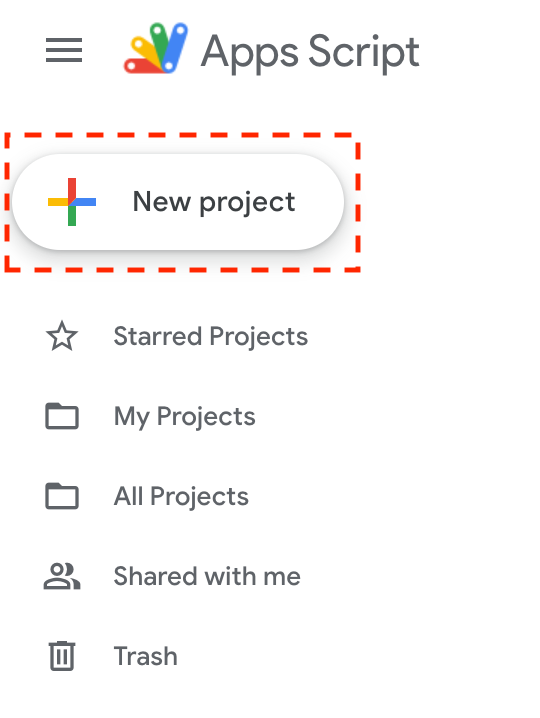
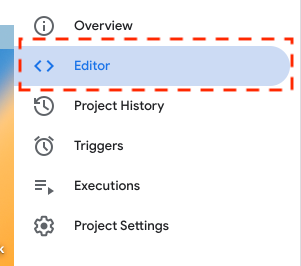
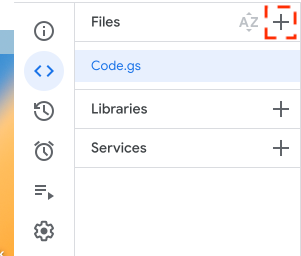
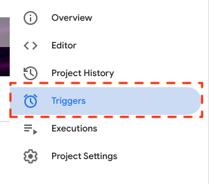
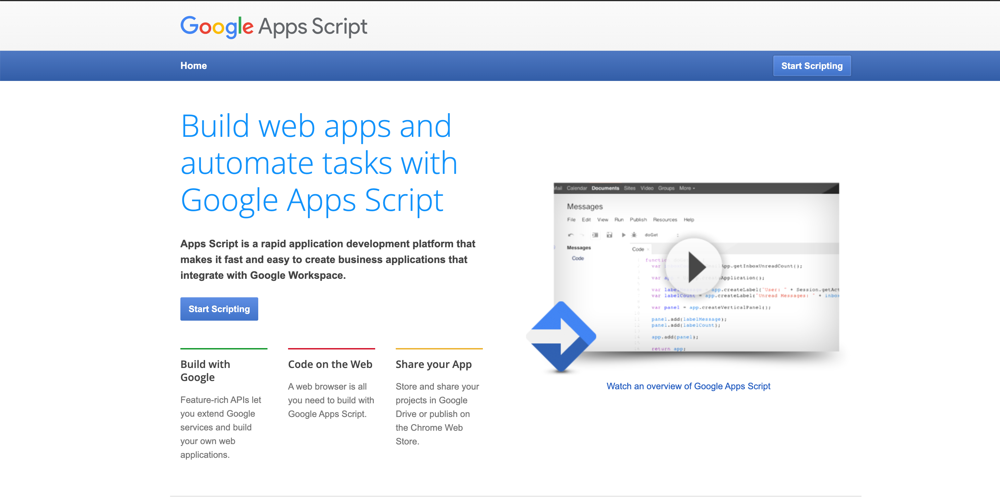
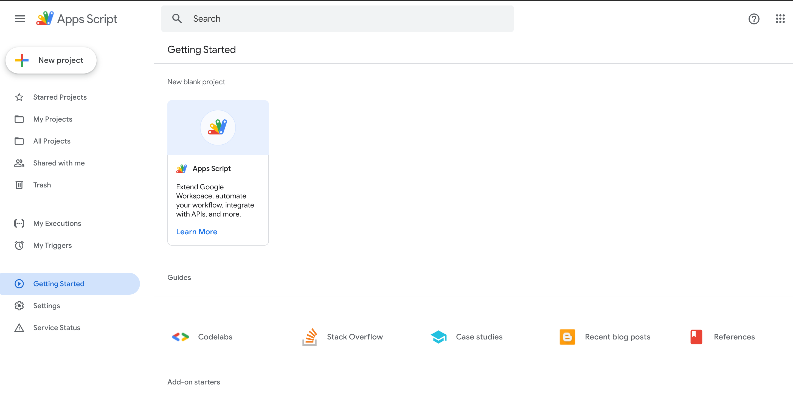

# WellBot

**A Google App Scripts Bot for supporting team morale and happiness**

[I JUST WANT TO GET GOING](#low-tech-quick-start)

## Why Would I Use This?

Anyone managing a squad is aware that there is much that happens that they don't know about. Private feedback conversations, low grade grudges and pleasant moments all come and go behind closed doors.

Each squad member has their own personal life, communities that they participate in at work, and relationships with the squad management themselves.

Everyone's reality is complex, and we never see it all.

When things go wrong, when someone is upset, or needs help, how do we know to help them?

This app bot is a set of scripts designed to help squads to share, monitor and support their collective health.

The main function is to create Google Forms based off of a set template:

1. to gather **anonymous** feedback on how squad members are feeling
2. distribute that form to your squad members
3. send summaries to the squad leads and trio for them to review and act on.

If you are managing multiple teams, as part of a wider tribe, then the bot is able to generate forms for each squad individually, and send summaries for both each squad and for the whole collective at the right level.

## Do I Need To Be A Code Monkey?

You don't have to know how to code to use this bot. All that is required is a Google Workspaces account, the ability to copy and paste some files, and altering
_one file_ with contact information in javascript (following a template provided).

This bot has been written to be simple to use. Instructions are provided below.

## Getting Started

### Low Tech Quick Start

1. In [Google App Scripts](#google-app-scripts-access), create a new project

   

2. Go to the editor

   

3. Copy all the files from [the utils source folder](src/utils) and then [the bot source folder](src/bot) into the app scripts project by clicking the plus symbol next to Files

   > This part is currently tedious as you have to move each file separately - it is just as easy to copy all file content in order into the one file

   > IMPORTANT: Ensure that you have the files in the right order in the app script project, or the bot will not work

   

4. Copy the file [StartHere.template.js](src/StartHere.template.js) into the app scripts project, changing the placeholder values to be [your tribe's real values](docs/configuration.md)
5. Go to the triggers menu on the left of the page and add click a new trigger

   

6. Select the following:
    - Function to run: `surveyTribeMorale`
    - Deployment should run: `Head`
    - Event source: `Time-driven`
    - Type of time based trigger: `Week timer`
    - Day of week: `Monday`
    - Time of day: `8am to 9am`
7. Add another trigger, this time selecting the following:
    - Function to run: `closeTribeMoraleSurveys`
    - Deployment should run: `Head`
    - Event source: `Time-driven`
    - Type of time based trigger: `Week timer`
    - Day of week: `Thursday`
    - Time of day: `5pm to 6pm`

You now have two triggers. One will create and distribute the forms to your squads every Monday morning.

The other will close the forms and send a summary to the Trio and Squad Leads every Thursday evening.

> N.B. Google should prompt you to approve permissions to create forms, and to send emails and gchat messages (if webhooks provided). It might similarly ask to be allowed to use some libraries.
>
> If it does not, you may need to run the function `surveyTribeMorale` manually for the first time for this to happen. All of these need to be approved for the bot to work.

To see if the trigger has run successfully, you can look under `Executions` in the side menu to see the status of every run.

### Deploying with Clasp

Google offers a Client Library for deploying App Script Projects (`clasp`) that can be used to push the code directly to the project without all the copy and pasting.

The `clasp` library is functional, but limited and can be awkward. Care should be taken when using it.

> In particular, at time of writing, there is no way to push individual files - it must manage the entire project in one go.

If you are comfortable using a command line tool, you can build the bot using `clasp`:

```zsh
set -e
# In repo root directory
# Install npm packages
npm install
yarn install --frozen-lockfile

# Authorise clasp with google via the browser
yarn run clasp login

# Create new app script project with clasp
# N.B. skip if you've already created your project
yarn run clasp create --title Wellbot --type standalone --rootDir src

# Clasp has created a .clasp.template.json file in src/ which is the wrong place - create the right file
NEW_SCRIPT_ID=$(jq '.scriptId' src/.clasp.json | sed -e 's/^"//' -e 's/"$//' ); \
cat .clasp.template.json | sed -e s/SCRIPT_ID_PLACEHOLDER/$NEW_SCRIPT_ID/ > .clasp.json

# Remove the useless file that clasp created now we've made the useful one
rm src/.clasp.json

yarn run clasp push --force
```

After this, you can run clasp commands as normal (e.g. `clasp push`) to manage the project. The file `.clasp.json` is created to configure the tool, and should be kept for future use.

It will still be necessary to add your configuration file based off of [the config template](src/StartHere.template.js).

## Glossary

I have attempted to use language based off of the Spotify model where possible:

- **Squad**: a small autonomous team of member practitioners working on a shared problem (e.g. a two pizza team)
- **Squad Lead**: a senior manager within the squad responsible for looking after the squad members
- **Tribe**: a group of teams working in a similar field that interact with each other regularly
- **Trio**: the senior management responsible for looking after the whole Tribe

## Prerequisites

### Google App Scripts Access



This bot runs on the Google Workspace utility [Google App Scripts](https://www.google.com/script), which is part of their enterprise offering. To check if you can use app scripts:

1. Go to the [App Scripts Dashboard](https://script.google.com/u/1/home/start)
2. Login to your Google Workspaces user, and approve permissions

You should now be able to view the Apps Scripts Dashboard


